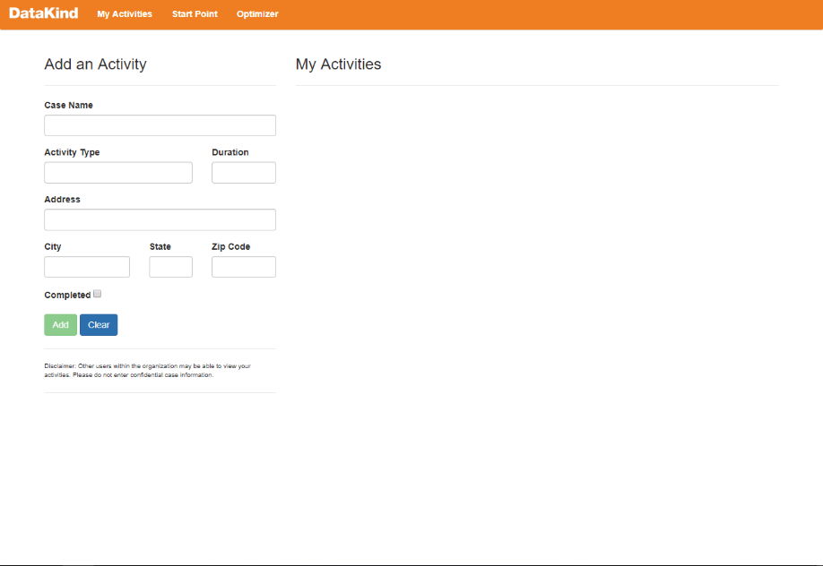
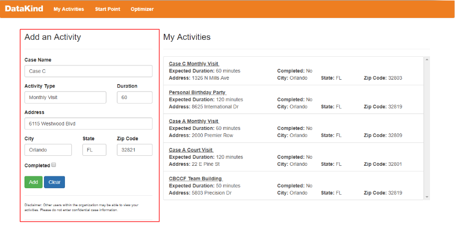
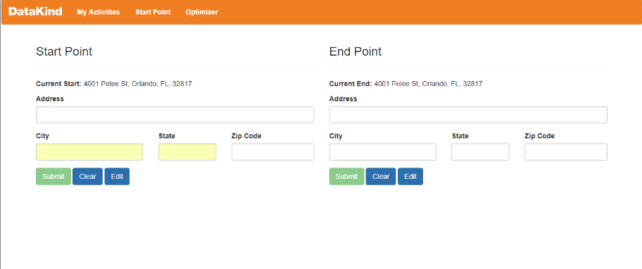
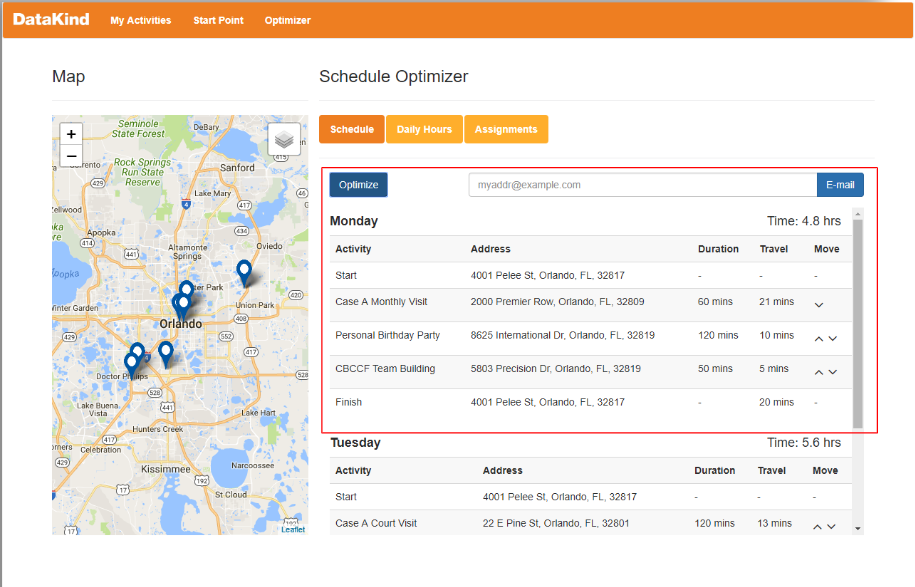
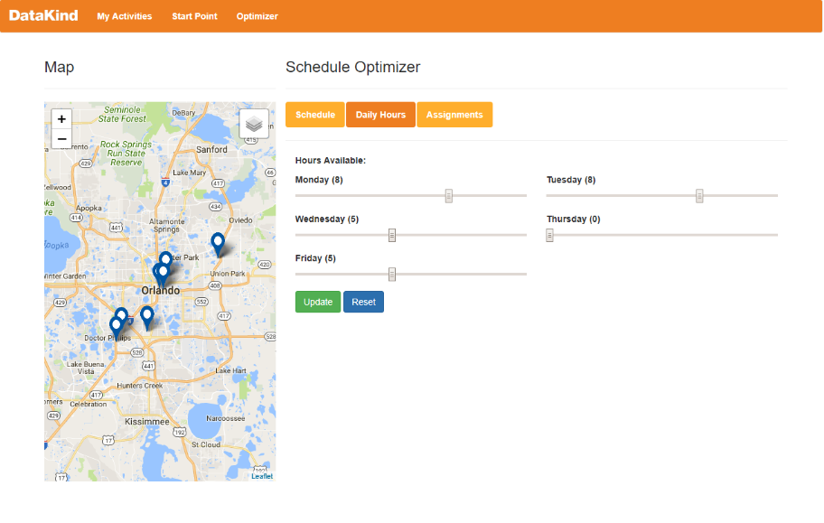
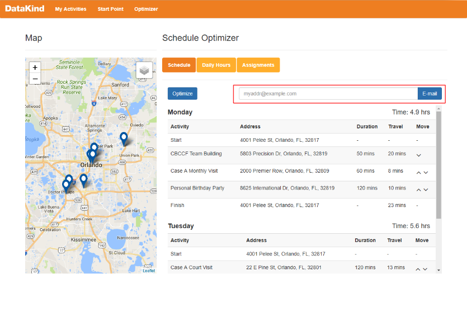

# Caseworker Scheduler

DataKind worked with Community Based Care of Central Florida to design a solution for helping their caseworkers sequence their required activities more efficiently to reduce planning and travel time. An ideal solution would optimize the caseworker’s weekly activities (what is the best sequence for reducing travel while respecting those events that occur at fixed times), yet at the same time be flexible to accommodate constraints that may arise.

--------------------------

## Goal

Build a tool that enables case workers to schedule their activities more effectively in order to allow them to spend more time on child care.

* Case workers are the intended user
* The tool helps case workers decide how to sequence tasks
* Users log into the tool once per week
* Solutions should be flexible
* The system may be able to leverage information about activity on a particular case to identify upcoming due dates

--------------------------

## Outcome 
* Created an Angular application that enables case workers to manage and schedule activities
* Computes an optimal schedule for a case worker, given the case worker’s activities and constraints
* Allows users to modify a schedule after it has been optimized
* Pulls in individual user information based on an id in the URL
* Modified baseline Angular configurations to ensure that it is compatible with Internet Explorer
* Built a backend application using Python and MySQL
* Delivered a unit tested Python package that includes web services, and interface with the COIN-OR integer programming solver, and utilities to help manage the application
* MySQL database with an automated build process

--------------------------

## Tool  

### My Activities 
On the activities page users can add activities for the week. The tool can also auto-import activities in a JSON format and populate a workers known activities in advance. Case workers can then also add other activities manually. 

### Adding and Activity 
To manually add an activity users can fill out the fields below. Duration and Address are the most important fields to the optimizer. The Activity Type field could be modified  if there are prescribed durations for certain activities but that is not currently implemented. Once the information is complete users can click `add` and the activity will be added to user activities. 

**Note**: Addresses shown are placeholder and do not show actual case addresses. 

### Start Point: Set User Start and End Points
On the top toolbar users can switch to the Start and End point page (Start Point). This allows users to set where they will begin and end their work day. These will be saved to a database and held static until changed. 

### Optimize Schedule  
Once users have activities and start/end points, they can click the Optimizer button to load the Optimization page. 

Here users have some options:

* Schedule: Will show the current state of the schedule.
* Daily Hours: Will allow users to set the available hours and days a case worker is available. 
* Assignments: Will allow users to set certain activities to happen on certain days, or occur before or after other activities. 
* Optimize: Will optimize the schedule given availability and constraints.
* Email Scheduler: If enabled (setup required), can email results of the schedule to user.
 

### Set User Daily Availability 
User can select days and number of hours available. 

### Set User Assignments 
User can apply constraints such as specific days for events, or sequencing of events. 

### Email Scheduler  
Users can enter email address and have it sent to them. 
